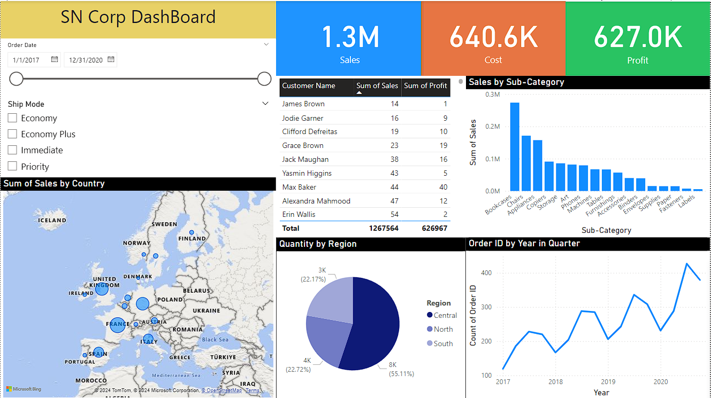

# Power BI Workshop Project

## Overview
This project is based on the Power BI workshop conducted by Jatan Shah, a Microsoft Certified Trainer. During this workshop, I learned to create dashboards in Power BI and gained valuable insights into data visualization and reporting.

## Project Contents
This repository includes:

1. **Dashboard File**: 
   - `work01.bix`: The Power BI dashboard I created during the workshop.

2. **Visuals**:
   - **Dashboard Screenshot**: 
     

3. **Certificates**:
   - **Workshop Completion Certificate**: 
     [Certificate](images/certificate.pdf)

4. **Workshop Notes**:
   - `Day 1 - Notes.pdf`: Notes from the first day of the workshop.
   - `Day 2 - Notes.pdf`: Notes from the second day of the workshop.

5. **Handwritten Notes**:
   - `day01.txt`: My handwritten notes from the first day.
   - `day02.txt`: My handwritten notes from the second day.

## Workshop Details
The workshop was very informative and covered essential aspects of Power BI, including creating dashboards, data transformation, and visualization. It was organized by Jatan Shah's team at Skill Nation.

- **Workshop Registration**: [Power BI Workshop](https://learn.jatanshah.com/powerbi-sc/)
- **Instructor**: Jatan Shah (Microsoft Certified Trainer)
- **Master Class**: The workshop also provided information on an advanced master class covering Excel, SQL, Power BI, and other courses.

## Insights
This workshop was an excellent opportunity to deepen my understanding of Power BI and its practical applications in data analysis. I highly recommend it for anyone looking to enhance their data visualization skills.

## Acknowledgments
Special thanks to Jatan Shah and the Skill Nation team for organizing this workshop.

## License
MIT License

The MIT License is included in the repository. See [LICENSE](LICENSE) for more details.
