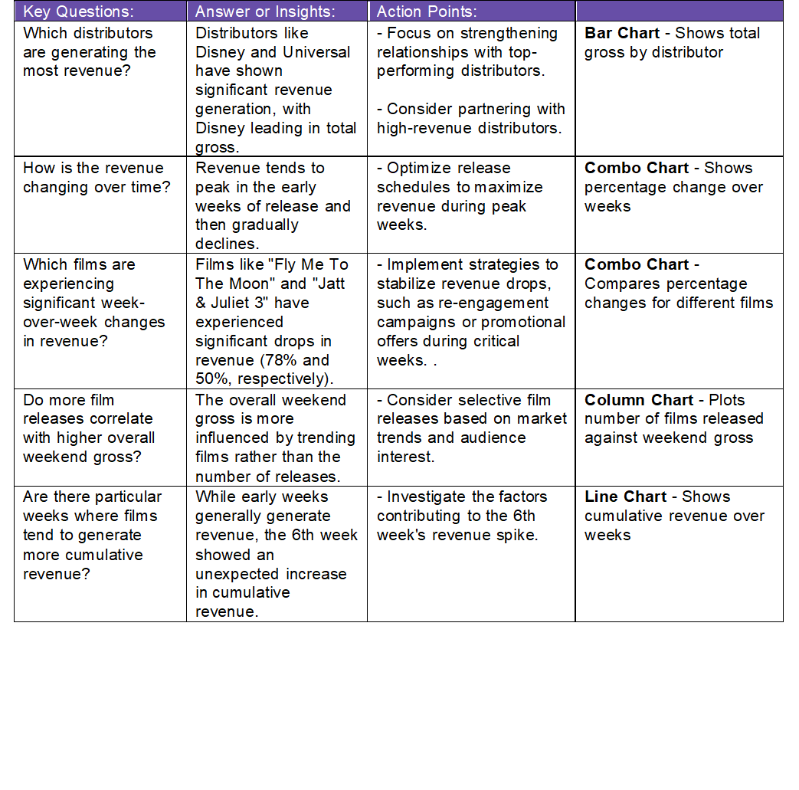
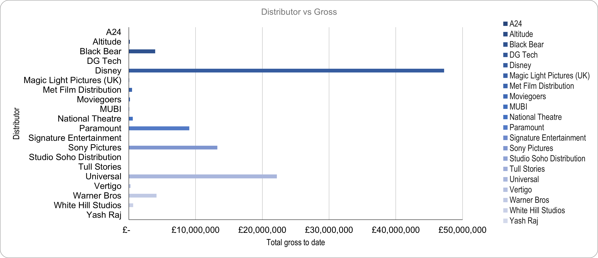
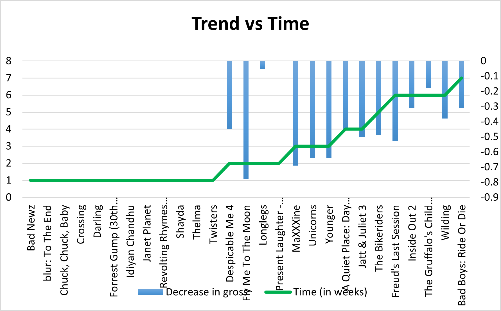
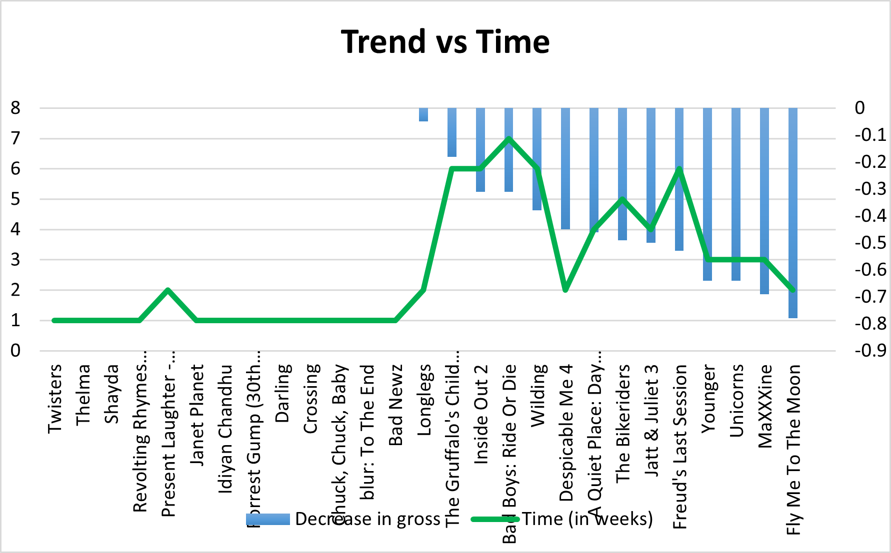
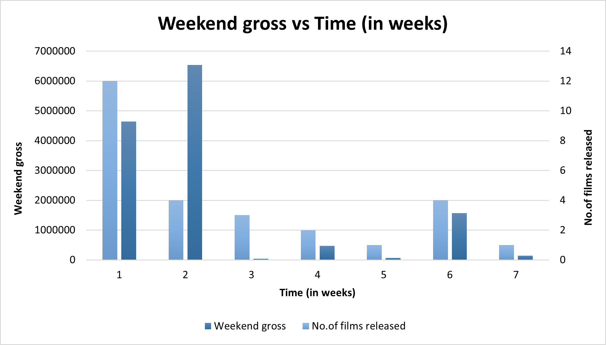
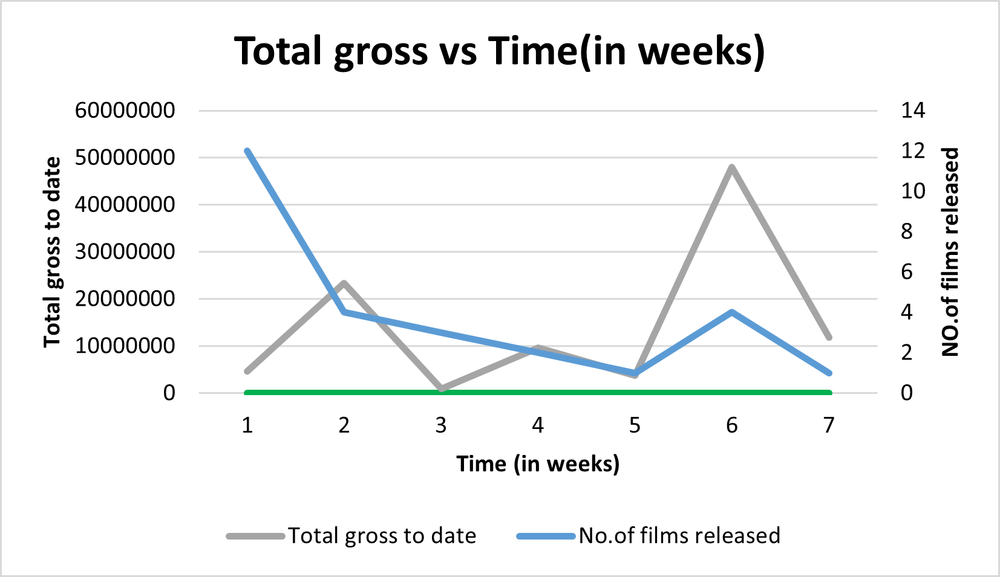
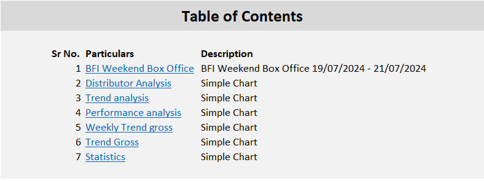

# BFI Film Industry Analysis

## Overview
This project analyzes various trends and distributions within the British Film Institute (BFI) film industry data. The analyses include:

## Key Questions Addressed
This analysis aims to answer the following key questions:
1. **Which distributors are generating the most revenue?**
2. **How is the revenue changing over time?**
3. **Which films are experiencing significant week-over-week changes in revenue?**
4. **Do more film releases correlate with higher overall weekend gross?**
5. **Are there particular weeks where films tend to generate more cumulative revenue?**

## Analysis and Insights
- **Trend Analysis**: Examining revenue growth over time.
- **Distributor Analysis**: Comparing total gross revenue across different film distributors.
- **Performance Analysis**: Evaluating the percentage change in performance week over week.
- **Weekly Trend Gross**: Analyzing the correlation between the number of films released and their weekend gross.
- **Trend Gross**: Tracking total gross revenue over different weeks of release.

## Files
- **LProject 01.xlsx**: Contains all the data, analyses, and visualizations.
- **BFI Data Analysis.pptx**: A PowerPoint presentation summarizing the analysis and findings.
- **Key Questions_.docx**: A Word document outlining key points and recommended actions.

## Snapshots of Documents

### PowerPoint Presentation

### Key Points & Action Plan Document

## Visuals
Here are some snapshots of the analysis:

### Distributor Analysis

### Trend Analysis

### Performance Analysis

### Weekly Trend Gross

### Trend Gross

## Installation
To view or modify the analysis, open the **BFI_Film_Industry_Analysis.xlsx** file in Excel.

## Usage
The Excel file **BFI_Film_Industry_Analysis.xlsx** is organized with a Table of Contents (TOC) sheet to help you navigate to each analysis easily. Here’s how to use it:

- **Table of Contents (TOC)**: The TOC sheet provides links to each analysis sheet. Click on the sheet names in the TOC to quickly jump to the relevant analysis.
- **Distributor Analysis**: Review the 'Distributor Analysis' sheet to see a comparison of total gross revenue across different distributors.
- **Trend Analysis**: Check the 'Trend Analysis' sheet for graphs depicting revenue growth over time.
- **Performance Analysis**: Explore the 'Performance Analysis' sheet for insights on week-over-week performance.
- **Weekly Trend Gross**: Use the 'Weekly Trend Gross' sheet to analyze the correlation between the number of films released and their weekend gross.
- **Trend Gross**: View the 'Trend Gross' sheet to understand cumulative gross revenue trends.

## Example Screenshot of TOC Sheet

## Credits and Acknowledgments
This project was inspired by the CareerFoundry YouTube channel and course materials:

- **Course Playlist**: [CareerFoundry Data Analysis Course](https://youtube.com/playlist?list=PL4GEkVtNYGlKx_8AoP4VkQplMIPDblsSj&si=8B4Z1RKr8rwr8v1X)
- **Instructor**: Dr. Hummera Noor Minhas (Professional Data Analysis & CareerFoundry Mentor)
- **Datasets**: The datasets were provided by CareerFoundry. I used the 10th dataset (BFI Film Industry) while Dr. Hummera used the 9th dataset (NYC Taxi Trip Data). For more datasets, visit [CareerFoundry Datasets](https://careerfoundry.com/en/blog/data-analytics/where-to-find-free-datasets/).

## Additional Resources
If you're interested in exploring data analysis further, CareerFoundry offers a free introductory course to see if data analysis is the right field for you:

- [Free Data Analysis Course](https://careerfoundry.com/en/short-courses/become-a-data-analyst/?utm_source=youtube.com&utm_medium=referral&utm_campaign=DAT_DASC1_240222&utm_term=short-course)

## License
MIT License

The MIT License is included in the repository. See [LICENSE](LICENSE) for more details.
